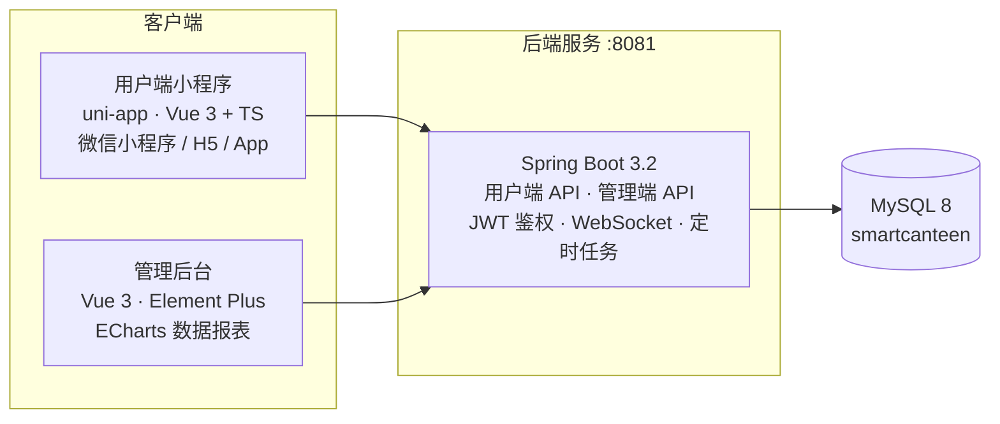

<div align="center">

# 🍱 校园智慧食堂系统

### Campus Canteen System

一套面向高校食堂的完整数字化解决方案：**点餐小程序 + 管理后台 + 统一后端服务**，
覆盖从菜品上架、在线点餐、支付结算到营养分析与经营报表的完整链路。

[](smart-canteen-server)
[](smart-canteen-server)
[](smart-canteen-admin)
[](smart-canteen-app)
[](sql)
[](https://github.com/EricKingWhy/campus-canteen-system/commits/main)

</div>

---

## ✨ 特性

### 📱 用户端小程序（uni-app，一套代码多端运行，微信小程序优先）

- **在线点餐**：分类浏览、菜品详情、购物车、提交订单
- **订单中心**：订单详情（支持下拉刷新）、历史订单
- **支付结算**：独立支付分包（`subpkg-pay`），按需加载
- **地址管理**：新增 / 修改收货地址
- **我的收藏**：菜品收藏与取消收藏
- **🥗 营养与健康分析**：菜品热量 / 蛋白质 / 脂肪 / 碳水展示、过敏原标签、个人健康分析页
- **账号体系**：登录鉴权、个人中心、用户信息设置

### 🖥 管理后台（Vue 3 + Element Plus）

- **工作台**：经营数据总览
- **菜品管理**：菜品 / 分类 / 套餐的增删改查与上下架
- **订单管理**：订单查询、状态流转
- **员工管理**：员工账号与信息维护
- **数据报表**：基于 ECharts 的经营数据可视化
- **店铺设置**：营业状态管理

### ⚙️ 后端服务（Spring Boot）

- **双端 API 体系**：用户端 / 管理端控制器隔离，JWT 双密钥鉴权体系
- **实时推送**：WebSocket 长连接（订单状态实时通知）
- **定时任务**：业务定时调度
- **工程化**：AOP 日志切面、统一异常处理、拦截器鉴权
- **数据层**：MyBatis-Plus + Druid 连接池 + MySQL

### 🛠 数据治理脚本（Python）

- 菜品数据丰富（`enrich_dish_data.py`）：批量补全菜品营养与标签数据
- 表结构修复脚本：`fix_db_schema.py` / `fix_orders_table.py` / `fix_user_table.py`
- 管理端流程冒烟测试：`test_admin_flow.py`

---

## 🏗 系统架构



---

## 🛠 技术栈

| 分层       | 技术选型                                                        |
| ---------- | --------------------------------------------------------------- |
| 后端       | Spring Boot 3.2.5 · Java 17 · MyBatis-Plus 3.0.3 · Druid · Maven 多模块 |
| 用户端     | uni-app · Vue 3 · TypeScript · Pinia · uni-ui                   |
| 管理后台   | Vue 3 · Vite · TypeScript · Element Plus · ECharts · Pinia · Vue Router |
| 数据库     | MySQL 8.0                                                       |
| 实时通信   | WebSocket                                                       |
| 数据治理   | Python 脚本                                                     |

---

## 🚀 快速开始

### 前置条件

| 依赖        | 版本     |
| ----------- | -------- |
| JDK         | 17+      |
| Maven       | 3.8+     |
| Node.js     | 18+      |
| MySQL       | 8.0+     |
| 微信开发者工具 | 最新版（小程序端） |

### 1️⃣ 初始化数据库

```bash
# 创建数据库后，按顺序执行初始化脚本
mysql -u root -p < smart-canteen-server/server/src/main/resources/sql/V2__Add_Nutrition_And_Allergen_Data.sql
mysql -u root -p < sql/upgrade_dish_nutrition.sql
mysql -u root -p < sql/upgrade_dish_allergen_tags.sql
mysql -u root -p < sql/upgrade_employee_gender_age.sql
```

### 2️⃣ 启动后端服务

```bash
cd smart-canteen-server

# 按需修改 server/src/main/resources/application-dev.yml 中的数据库连接
mvn -pl server -am package -DskipTests
java -jar server/target/*.jar
```

后端默认运行在 `http://localhost:8081`。

### 3️⃣ 启动管理后台

```bash
cd smart-canteen-admin
npm install
npm run dev      # 开发模式
npm run build    # 生产构建（含类型检查）
```

### 4️⃣ 运行用户端小程序

```bash
cd smart-canteen-app
npm install

# 微信小程序（推荐）：用微信开发者工具打开 dist/dev/mp-weixin
npm run dev:mp-weixin

# H5 预览
npm run dev:h5
```

> ✅ 宣称完成前的必跑检查：`npm run build:mp-weixin`（真机问题在开发者工具中可能无法复现，iOS / Android 微信需分别验证）

---

## 📁 项目结构

```
campus-canteen-system/
├── smart-canteen-server/          # 后端服务（Spring Boot 多模块 Maven 工程）
│   ├── common/                   # 公共模块：常量 / 工具 / 异常
│   ├── pojo/                     # 实体与 DTO
│   └── server/                   # 启动模块
│       └── src/main/java/fun/cyhgraph/
│           ├── controller/       # user（用户端）/ admin（管理端）双 API 体系
│           ├── service/          # 业务逻辑
│           ├── mapper/           # MyBatis-Plus 数据访问
│           ├── websocket/        # 实时消息推送
│           ├── task/             # 定时任务
│           ├── interceptor/      # JWT 鉴权拦截器
│           ├── aspect/           # AOP 切面
│           └── handler/          # 全局异常处理
├── smart-canteen-app/            # 用户端小程序（uni-app）
│   └── src/
│       ├── pages/                # 登录 / 首页 / 点餐 / 订单 / 支付 / 健康分析 / 我的…
│       ├── subpkg-pay/           # 支付分包（按需加载）
│       ├── stores/               # Pinia 状态管理
│       └── api/                  # 后端接口封装
├── smart-canteen-admin/          # 管理后台（Vue 3 + Element Plus）
├── sql/                          # 数据库升级脚本（营养字段 / 过敏原标签 / 员工字段）
├── scripts/                      # Python 数据治理与修复脚本
├── docs/                         # 开发日志 / 每日报告 / 线程交接 / 工作流手册
├── get_dishes.py                 # 菜品数据抓取工具
└── MCP_AND_SKILLS_INVENTORY.md   # MCP 与 Skills 资产清单
```

---

## 📖 文档

| 文档 | 说明 |
| ---- | ---- |
| [`docs/`](docs/) | 开发日志（`dev_log_*`）、每日报告、线程交接（`THREAD_HANDOFF.md` + `handoffs/`） |
| [`docs/ECC_专业工作流使用手册.md`](docs/ECC_专业工作流使用手册.md) | 新功能开发 / 代码评审 / 发布回归等场景的速查手册 |
| [`MCP_AND_SKILLS_INVENTORY.md`](MCP_AND_SKILLS_INVENTORY.md) | MCP Server 与 Skills 资产清单 |

---

## 🤝 参与贡献

欢迎提交 Issue 与 Pull Request。提 PR 前请确保：

1. 小程序端改动通过 `npm run build:mp-weixin` 构建检查
2. 后端改动通过 Maven 编译与现有测试
3. 涉及表结构变更时，同步在 `sql/` 下补充升级脚本（MySQL 8 语法，幂等写法）

---

## 📄 开源协议

本仓库暂未附带开源许可证，默认保留所有权利。如需开源，请补充 `LICENSE` 文件后更新本节。
